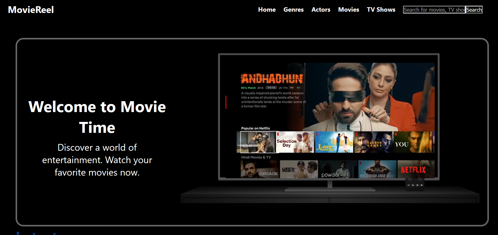
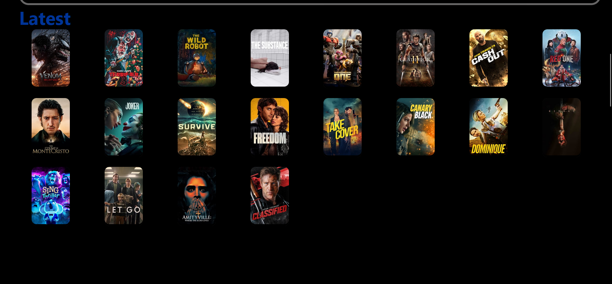

# MovieReel

## Project Description
**MovieReel** is an interactive web application that allows users to explore detailed information about movies and actors using a powerful movie API. Users can browse popular movies, view actor details, and watch trailers, all while navigating an intuitive interface. The project highlights the integration of API data to create dynamic and user-friendly pages.

## Tools Used
- HTML, CSS, JavaScript
- React.js
- Movie API for data

## Authors
- Nonhlanhla Mazibuko - [GitHub](https://github.com/NonhlanhlaMazibuko) | [LinkedIn](https://www.linkedin.com/in/nonhlanhla-mazibuko-879636214/)
- Konanani Nemauluma - [GitHub](https://github.com/member1) | [LinkedIn](https://linkedin.com/in/member1)

## Screenshot

